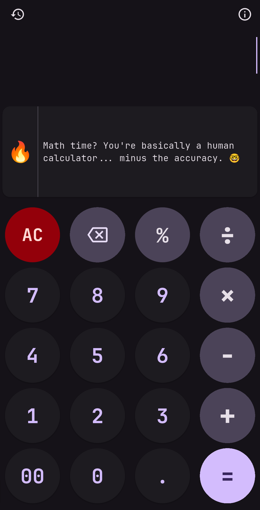

# 🔥 RoastCalc - AI-Powered Calculator

A personal project: an AI-based calculator that roasts your calculations with personalized humor powered by Google Gemini AI.

**Do math. Get roasted — Gemini AI with history-aware roasts.**

## Features

- 🧮 Full-featured calculator with basic operations, percentages, and decimals
- 🤖 AI-powered roasts using Google Gemini
- 📡 50+ offline roasts for when internet is unavailable
- 📝 Persistent calculation history
- 🎨 Dark/light theme support

## Quick Start

### Prerequisites
- Flutter SDK (v3.0+)
- Google Generative AI API key (free from [Google AI Studio](https://aistudio.google.com/app/apikey))

### Setup

```bash
git clone https://github.com/ruchirraina/roastcalc.git
cd roastcalc
flutter pub get
```

Create a `.env` file in the project root:
```
GOOGLE_API_KEY=your_api_key_here
```

Run the app:
```bash
flutter run
```

## How It Works

The RoastArea component monitors your calculation history and uses Gemini AI to generate personalized roasts. When offline, it uses pre-written roasts instead.

## 🖼️ Screenshots

<div>
	
	
</div>

## License

MIT License - Do whatever you want with this code.

## Author

Made by **Ruchir Raina** - [@ruchirraina](https://github.com/ruchirraina)
